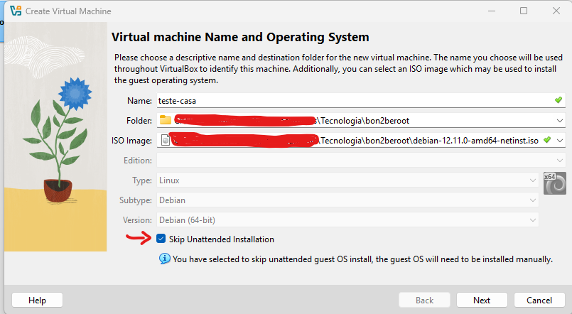
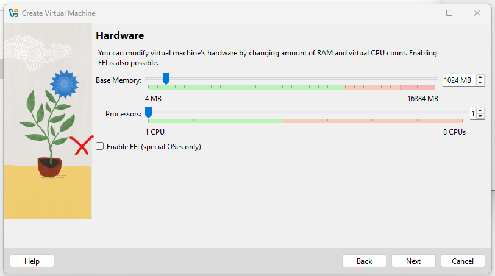
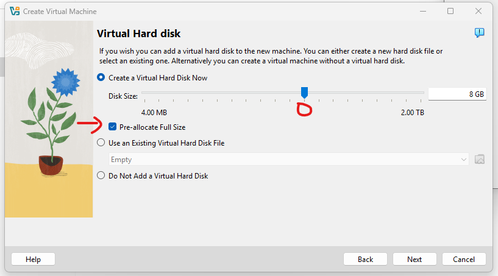
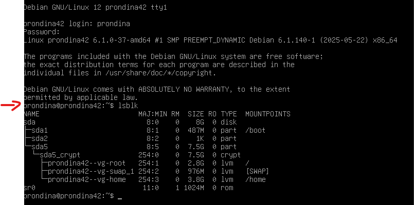
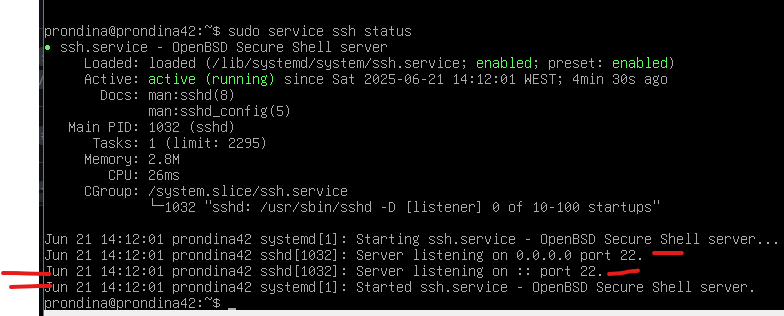
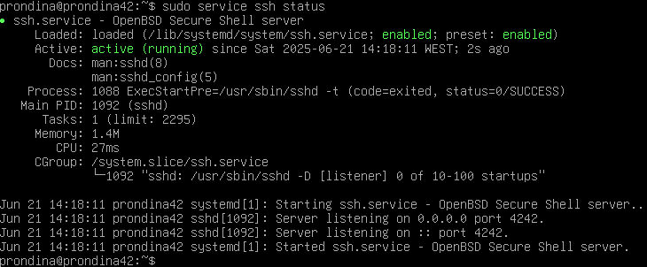
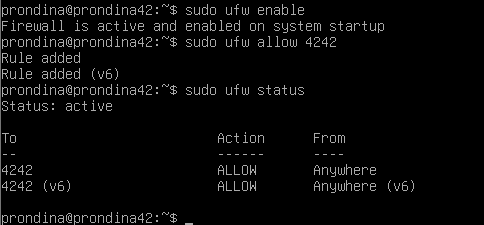
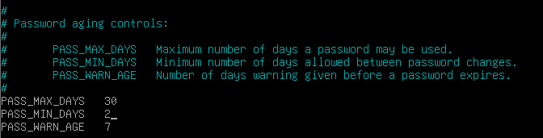
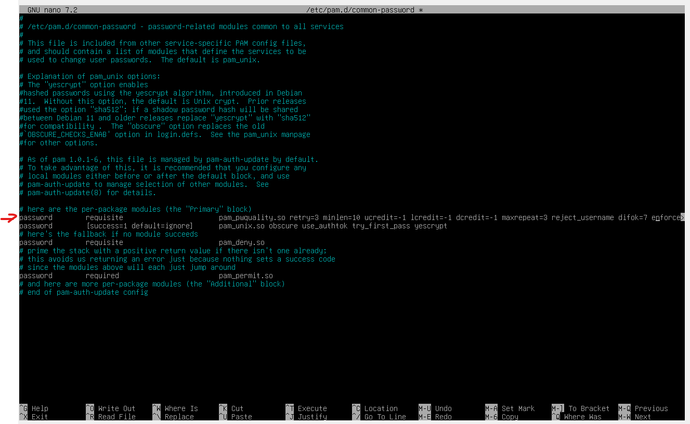
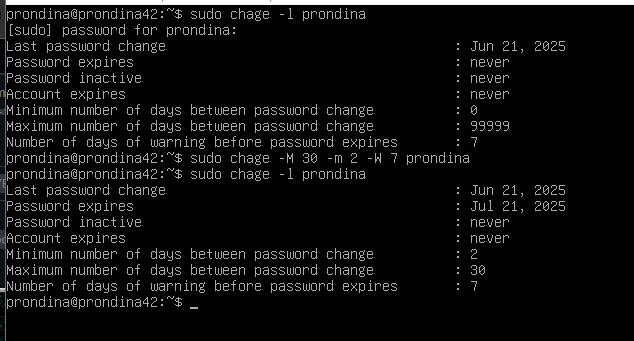

# Born 2 be Root

O projeto consiste na criação de uma VM (Máquina Virtual), onde faremos ajustes em:

- 
- Sudo;
- SSH;
- Política de senhas;

## 1 - Hypervisor

Programa que permite criar e gerenciar VMs no computador. Utilizado para criar um ambiente seguro.
´
Tipo de Hipervisor, utilizaremos o `Tipo 2: Hoste`
Tipo | Nome | Utilizado em | Exemplos
-|-|-|-
 1 | Bare Metal | Funciona direto no hardware (igual sistema operacional). Utilizados em ambiente de servidores | VMWarevESXi, Microsoft Hyper-V, Proxmox
 2 | Hosted | Roda dentro do sistema operacional (Windowns, Linux), um programa dentro do sistema | VirtualBox, VMware

## 2 - Distribuiçao Linux

!!!!!!!!

VERIFICAR DIFERENCA ENTRE AMBOS
Rocky e Debian

### Instalar Debian

No [site_oficial](www.debian.org/download) selecionar `amd64 debian-12.11.0...`, baixará arquivos.

> Erro no download --> se não possui espaço no computador! Baixará apenas arquivos que nao fará a instalação. 

- Arquivo ISO (após baixar o Debian) - é Semelhante a um CD com o arquivo do sistema para instalar.

Após baixar o arquivo, incluir o arquivo na pasta `home\sgoinfre`, diretório com maior espaço para realizar esse projeto.

Abrir programa: `Oracle VM VirtualBox Manager` e clicar em `New`.

Etapa | O que fazer?
---|---
Name | Nomeie sua VM;
Folder | Selecione o local de armazenamento: `pasta sgoinfre`
ISO Image | Escolha o arquivo download ISO (que deve estar na sgoinfre).
Ticar `Skip Unattended Installation` |  (pular instalaão não assistida),

**Skip Unattended Instalation**
 
Quando não marcamos (ticamos) esse elemento, o VirtualBox tenta automatizar o processo de instalação do sistema operacional, exemplos:

* Cria um usuário automaticamente;
* Define senha root por padrão;
* Pula a tela de seleção de idioma, teclado, fuso horário...

> A ideia do projeto é para criarmos todos esses elementos, um projeto do ZERO!

Proxima etapa, alocar memória:

Etapa | O que fazer?
---|---
Base Memory | 1024mb
Processors | 1
NAO ticar `Enable EFI` | Extensible Firmware Interface (Ele pode causar problemas no boot ou dificultar instalações mais simples, como a do Debian)

**Base Memory**

> RAM = Random Access Memory (memória de curto prazo do computador)

- Memória temporária usada por programas abertos;
- Quanto maior a RAM, mais programas podem rodar ao mesmo tempo;
- A RAM é encerrada ao desligar o pc.

**Processors**

> O processador é o cérebro da máquina.
> Os núcleos são como mini-cérebros dentro dele.

- O processador executa tarefas.
- Núcleos = tarefas paralelas possíveis.

MELHORAR: APRENDER MAIS!!!!!!

Próima e ultima etapa, `Virtual Hard Disk`

Etapa | O que fazer?
---|---
Tamanho do Disco | 8gb
Ticar `Pre-allocate Full size`| VirtualBox já separa 8 GB de espaço físico no computador, mesmo que o Debian só use 1 GB por enquanto. NÃO marcar, vai ocupar espaço aos poucos, conforme o Debian for precisando.

### Operar Sistema de Instalação

No programa: `Oracle VM VirtualBox Manager` e clicar em `Start`

Etapa | Descrição
-|-
`Start` | ligar a máquina
`Install` | iniciar a instalação do Debian
`Select language` | English
`Select your location` | other / Europe / Portugal
`Configure locales` | United States
`Configure the keyboard` | American English (em casa o teclado está Portuguese)
Loading | ...
`Configure the network --> Hostname` | hostname da máquina virtual: **username + 42**
`Configure the network --> Domain name` | pular etapa
`Set up users and passwords --> root password` | Por enquanto, qualquer senha (grave-a!). 
Repita a senha na próxima etapa
`Set up users and passwords --> full name...` | O nome do usuário = Pamela Rondina
`Set up users and passwords --> username for your account` | username
`Set up users and passwords --> choose a password for the new user` | Por enquanto, qualquer senha (grave-a!). Repita a senha na próxima etapa
`Configure the clock` | Lisbon
Loading | ...

Questions:
1. O QUE 'E HOSTNAME??
2. Por que pular Domain Name??

### Partições

Etapa | Descrição
-|-
`Partition disks` | Guided - use entire disk and set up encrypyted LVM
`Partition disks --> Select disk to partition` | SCSI2 ... (a opçãp já aparece!)
`Partition disks --> Partitioning scheme` | Separate / home partition / Yes
Loading | ...
`Partition disks --> Encryption passphrase` | senha importante, cada start da VM ela será utilizada ex: @Ilovebolo8 (grave-a!). Repita a senha na próxima etapa
`Partition disks --> amount of volume...` | max (atalho para especificar o tamanho máximo)
Loading | ...
`Partition disks` | Finish partitioning...
`Partition disks` | Write the changes to disk? YES
Loading | ...
`Configure the package manager` | NO (essa etapa está questionando se possuo mais arquivos ISO para serem instalados)
`Configure the package manager --> Debian archive...` | vai espelhar o arquivo Debian da região --> Portugal \ deb.debian.org
`Configure the package manager --> HTTP...` | pule essa etapa (press Enter, está questionando se utiliza proxy ou não - um bloqueador de acesso a sites na internet) NO (para a pesquisa!)
Loading | ...
`Software selection` | tire todos os tiques
Loading | ...
`Configuring grub-pc` | YES (carregador de Boot, necessário para iniciar a VM)
`Configuring grub-pc --> Device for boot...` | /dev/sda
Loading | ...
`Finish the installation` | Continue e VM criada! :)

Questions:
1. Por que estou separando as partições?
    Para que eu tenha espaços separados e que uma aplicação não interfira na outra.

### Acessar a VM

Após as configurações da VM e criação das Partições, chegou o momento de acessar a VM. Finalizamos o passo anterior, o terminal da VM estará aberto.

@Ilovebolocenoura42

Etapa | Descrição
-|-
Solicita a senha encriptada | @Ilovebolo8
hotname da máquina | prondina42
nome do usuário | Pamela Rondina
login | username --> prondina 
senha | criada anteriormente
comando `lsblk` | Mostra no terminal 

### Instalar Sudo

> `sudo`: permite o usuário executar comandos com privilégios de root. Root é o dono da P* toda.

Etapa | Descrição
-|-
`su -` | alterar para o root (incluir senha do usuário)
`apt update` | atualiza a lista de pacotes disponíveis nos repositórios
`apt install sudo` | instalar o pacote sudo, que permite executar comandos como root sem usar o `su -`
`adduser prondina sudo` | passar o usuário para o grupo sudo
`getent group sudo` | mostra quem está no grupo sudo 
`sudo reboot` | reinicia o sistema com segurança 
Reinicia a VM | Solicitará a senha encriptografada para acesso, e a login e senha usuário
`sudo -V` | verificar a versão do Sudo (apenas para curiosidade!)

> Agora liberado pois foi configurado o user para o grupo sudo.

**Configurar SUDO**

Etapa | Descrição
-|-
`sudo visudo` | abre as configurações do Sudo --> TODOS com `Defaults+(TAB)` (padrão)
`env_reset` | já consta
`mail_badpass` | já consta 
`passwd_tries=3` | 3 tentativas para conectar ao sudo
`badpass_message="QUALQUER TEXTO."` | Exibe uma mensagem personalizada ao usar uma senha errada com o sudo.
`logfile="/var/log/sudo/sudo.log"` | Define o arquivo de logs de entrada
`log_input, log_output` | entrada de logs e saída de logs
`iolog_dir="/var/log/sudo"` | Define o diretório para salvar logs de entrada e saída adicionais.
`requiretty` | Requer TTY para usar sudo.
`secure_path="/usr/local/sbin:/usr/local/bin:/usr/sbin:/usr/bin:/sbin:/bin **:/snap/bin**"` | Limita os caminhos que podem ser usados ​​pelo sudo para executar comandos. 
`CTRL+X YES ENTER` | Salvar e sair
`sudo mkdir -p /var/log/sudo` | criar diretorio
`sudo touch /var/log/sudo/sudo.log` | criar arquivo de logs

Questions:
1. O que é TTY para o sudo?

### Configurar SSH

Etapa | Descrição
-|-
`sudo apt install openssh-server -y` | Pacote de servidor que permite acessar a VM remotamente via terminal
`sudo nano /etc/ssh/sshd_config` | abre as configurações do SSH
`#Port 22` | Alterar para `Port 4242`
`#PermitRootLogin prohibit-passwaord` | Alterar para `PermitRootLogin no`
`CTRL+X YES ENTER` | Salvar e sair
`sudo service ssh status` | verifica o status do serviço SSH
`sudo service ssh restart` | reinicia o SSH devido a nova porta 4242
`ssh -V` | verificar a versão do SSH (apenas para curiosidade!)

Status SSH --> antes de `sudo service ssh restart` :

Status SSH --> depois de `sudo service ssh restart` :

### Configurar UFW

Etapa | Descrição
-|-
`sudo apt install ufw -y` | Pacote de servidor que instala o UFW (Uncomplicated Firewall), uma ferramenta simples e intuitiva para gerenciamento de firewall no Linux. Ela permite controlar o tráfego de entrada e saída da máquina, ajudando a proteger o sistema contra acessos não autorizados.
`sudo ufw enable` | ativar o firewall
`sudo ufw allow 4242` | permitir acesso a porta 4242 do SSH
`sudo ufw status` | visualizar o status das portas ALLOW (permitir)
`VERIFICAR !!! ` | verificar a versão do UFW (apenas para curiosidade!)

### Conectando...

**VM via SSH Port 4242**

Etapa | Descrição
-|-
`ssh prondina@127.0.0.1 -p 4242` | conectar
solicitará a senha -> yes
`exit` | para sair

**SSH de fora do terminal da VM Port 4242**

No app `Oracle VM VirtualBox Manager`.

Etapa | Descrição
-|-
`Settings` | ...
`Network` | clicar em Advanced\port Forwarding
`+` | Name: rule 1 \ Host Port: 4242 \ Guest Port: 4242
OK e OK | 

### Política de Senhas

Etapa | Descrição
-|-
`sudo nano /etc/login.defs` | abrir configuração de senhas, ir em `Password aging controls`
`PASS_MAX_DAYS 99999` | alterar para `PASS_MAX_DAYS 30`
`PASS_MIN_DAYS 0` | alterar para `PASS_MIN_DAYS 2`
`CTRL+X YES ENTER` | Salvar e sair

Etapa | Descrição
-|-
`sudo apt-get install libpam-pwquality -y` | Biblioteca que integra ao PAM (Pluggable Authentication Modules) e permite controlar a complexidade das senha
`sudo nano /etc/pam.d/common-password` | acessar arquivo para configurar as senhas (pode pedir senha do usuário)
`password requisite pam_pwquality.so retry=3` | adicionar cada um dos itens abaixo, separados por um espaço
`minlen=10` | Senha deve ter no mínimo 10 caracteres
`ucredit=-1` | 1 letra maiúscula
`lcredit=-1` | 1 letra minúscula
`dcredit=-1` |  1 número (dígito)
`maxrepeat=3`| Não permite mais de 3 caracteres repetidos seguidos
`reject_username`| Rejeita senhas iguais ao nome do usuário
`difok=7`| Senha nova precisa ter pelo menos 7 caracteres diferentes da antiga
`enforce_for_root`| Aplica as mesmas regras até para o usuário root
`CTRL+X YES ENTER` | Salvar e sair
`sudo reboot` | reinicia o sistema com segurança 

Etapa | Descrição
-|-
`passwd` | Alterar senha do usuário atual para a nova política
Current Password | Senha atual
New password | nova senha (de acorda a nova política)
`sudo chage -l user` | Lista as informações da expiração da senha de um usuário.
`sudo chage -M 30 -m 2 -W 7 user` | Define regras de validade e segurança para a senha do user.
`-M 30` | Máximo de 30 dias de validade da senha. Depois disso, o usuário é obrigado a trocar.
`-m 2` | Mínimo de 2 dias entre trocas. 
`-W 7` |  aviso com 7 dias de antecedência antes da senha expirar.

### 💻 Comandos básicos de gerenciamento Debian

 Comando | Explicação 
-|-|
`lsblk` | lista os discos e partições conectadas 
**SUDO** | ------
`su -` | alterar do usuario atual para o root
`apt` | gerenciador de pacotes do Debian/Ubuntu
`apt update` | atualiza a lista de pacotes disponíveis 
`apt install sudo` | instala o pacote sudo 
`adduser user sudo` | adiciona um usuário já criado ao grupo sudo 
`getent group sudo` | mostra quem está no grupo sudo 
`sudo reboot` | reinicia o sistema com seguranca 
`sudo -V` | versao do sudo
`sudo mkdir -p /va/log/sudo` | criar diretorio
`sudo touch /var/log/sudo/sudo.log` | criar arquivo de logs
**SSH** | ----------
`sudo apt install openssh-server -y` |pacote de servidor que permite acessar a VM remotamente via terminal
`sudo nano /etc/ssh/sshd_config` | abre as configuracoes do ssh
`sudo service ssh status` | verifica o status do serviço SSH
**UFW** | -----------
`sudo apt install ufw -y` | Pacote de servidor que permite ferramenta simples de firewall, que controla o tráfego de entrada e saída da sua máquina Linux.
`sudo ufw enable` | ativar o firewall
`sudo ufw allow 4242` | permitir acesso a porta 4242 do SSH
`sudo ufw status` | visualizar o status das portas ALLOW (permitir)
_________________________________________

**Resumo -> Instalar Debian** 

Etapa | . | Pra que serve?
-|-|-
1 [baixar Debian](www.debian.org/download) | selecionar `amd64 debian-12.11.0...` | Gera um arquivo ISO
2 Arquivo ISO | . | Gerado após realizar o download
3 Transferir ISO | Vai para a pasta `home\sgoinfre` | Diretòrio com maior espaço
4 Abrir VirtualBox | Um programa que ja esta instalado no pc | serve para realizar a leitura do arquivo ISO
5 ETAPA NEW

______________________________

Referencias | link
-|-
Instalar | [Debian](www.debian.org/distrib/netinst)
Guide | [born2beroot](https://github.com/chlimous/42-born2beroot_guide)
Nirmal Gope - Part 1 | [Youtube - Mandatory Part](https://www.youtube.com/watch?v=s2eM7L_etzo) 
Nirmal Gope - Part 2 | [Youtube - Mandatory Part](https://www.youtube.com/watch?v=3Vw0HlJHLTQ) 

